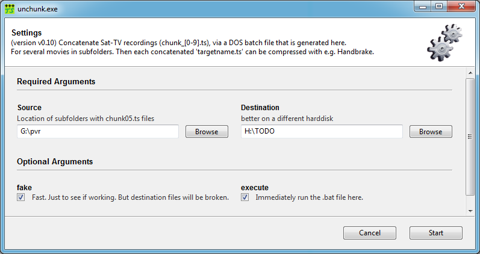

# unchunk.py  (v0.11)
Automation of compressing Sat-TV recordings into mp4

## Part 1: unchunk = concatenate
 
Sat-TV recordings are many '``chunk_[0-9].ts``' (transport stream) files per movie.  
  
This script generates a DOS batch file to concatenate them together; and for several movies in subfolders, one after the other. A huge time saver.  

Then each concatenated 'targetname.ts' can be compressed with e.g. Handbrake.

### NEW: Now with GUI
Download the Windows binary ``unchunk.exe``

* [unchunk_v0.11.zip](https://github.com/drandreaskrueger/unchunk/raw/master/releases/unchunk_v0.11.zip)

Or if you have Python 2.7 installed:

    pip install gooey
    python unchunkGooey.py 

If wxPython is not yet installed, see [Chris' instructions](https://github.com/chriskiehl/Gooey#installation-instructions). In Anaconda it is simply:

    conda install wxpython

The GUI is build with the wonderful ['Gooey' by Chris Kiehl](https://github.com/chriskiehl/Gooey):

### TODO
* Solve the missing ``user supplied directory images`` in PyInstaller build - please read [pyinstaller.md](pyinstaller.md), thanks!
* Find a way to also script the TS-->MP4 conversion in Handbrake, preparing the queue manually still takes a lot of time.
* Somehow add a (non-input, just) text widget to the GUI with a short: 
* ... manual that explains the whole process.   
  
### Stay Tuned
This is work in progress. More coming soon.

## Support Me

If you like this, show it: Send Bitcoin to [15c3a2E7b3TZuzeoYQyBSj7zAZmsBFyom7](http://blockr.io/address/info/15c3a2E7b3TZuzeoYQyBSj7zAZmsBFyom7) - thanks.

  

---
https://github.com/drandreaskrueger/unchunk 2016-01-31
